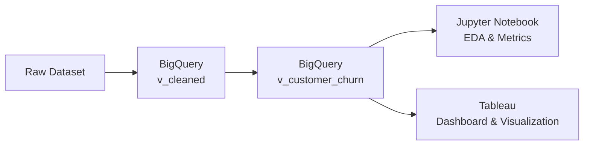

# E-commerce_analysis_project
## Мета проєкту
Цей набір даних використовується для аналізу поведінки покупців, відтоку клієнтів, створення систем рекомендацій.
## Опис датасету

Датасет налічує 17049 записів про транзакції з турецької онлайн-платформи роздрібної торгівлі за період з січня 2023 року по березень 2024 року. Набір даних надає детальну інформацію про демографічні дані клієнтів, купівельну поведінку, уподобання щодо продуктів та показники залученості.

## Структура даних
Датасет налічує 18 колонок з наступним описом:

Інформація про замовлення:
- **Order_ID**: Унікальний ідентифікатор для кожного замовлення (формат ORD_XXXXXX)
- **Date**: Дата транзакції (з 01.01.2023 по 26.03.2024)

Демографія клієнта:
- **Customer_ID**: Унікальний ідентифікатор клієнта (формат CUST_XXXXX)
- **Age**: Вік клієнта (18-75 років)
- **Gender**: Стать клієнта (чоловіча, жіноча, інша)
- **City**: Місто клієнта (10 великих міст Туреччини)

Інформація про продукт:
- **Product_Category**: 8 категорій (Electronics, Fashion, Home & Garden, Sports, Books, Beauty, Toys, Food)
- **Unit_Price**: Ціна за одиницю (TRY - турецька ліра)
- **Quality**: Кількість придбаних одиниць (1-5)

Деталі транзакції:
- **Discount_Amount**: Застосована знижка (якщо є)
- **Total_Amount**: Остаточна сума транзакції після знижки
- **Payment_Method**: Використаний спосіб оплати (5 типів)

Метрики поведінки клієнта:
- **Device_Type**: Пристрій, що використовувався для покупки (Mobile, Desktop, Tablet)
- **Session_Duration_Minutes**: Час, проведений на веб-сайті (1-120 хвилин)
- **Pages_Viewed**: Кількість сторінок, переглянутих під час сеансу (1-50)
- **Is_Returning_Customer**: Чи здійснював клієнт покупку раніше

Метрики після_покупки:
- **Delivery_Time_Days**: Тривалість_доставки (1-30 днів)
- **Customer_Rating**: Рейтинг_задоволеності_клієнта (1-5 зірок)

